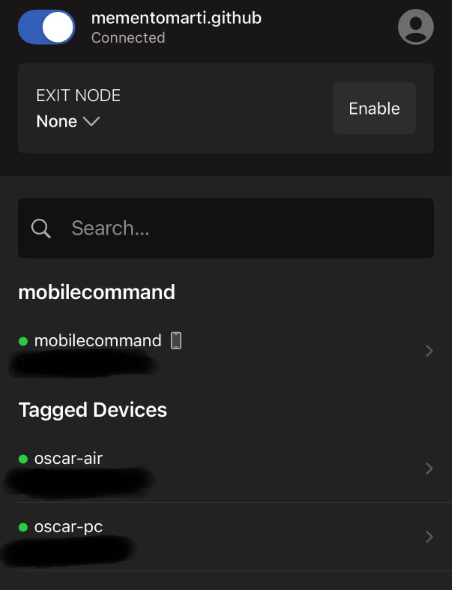
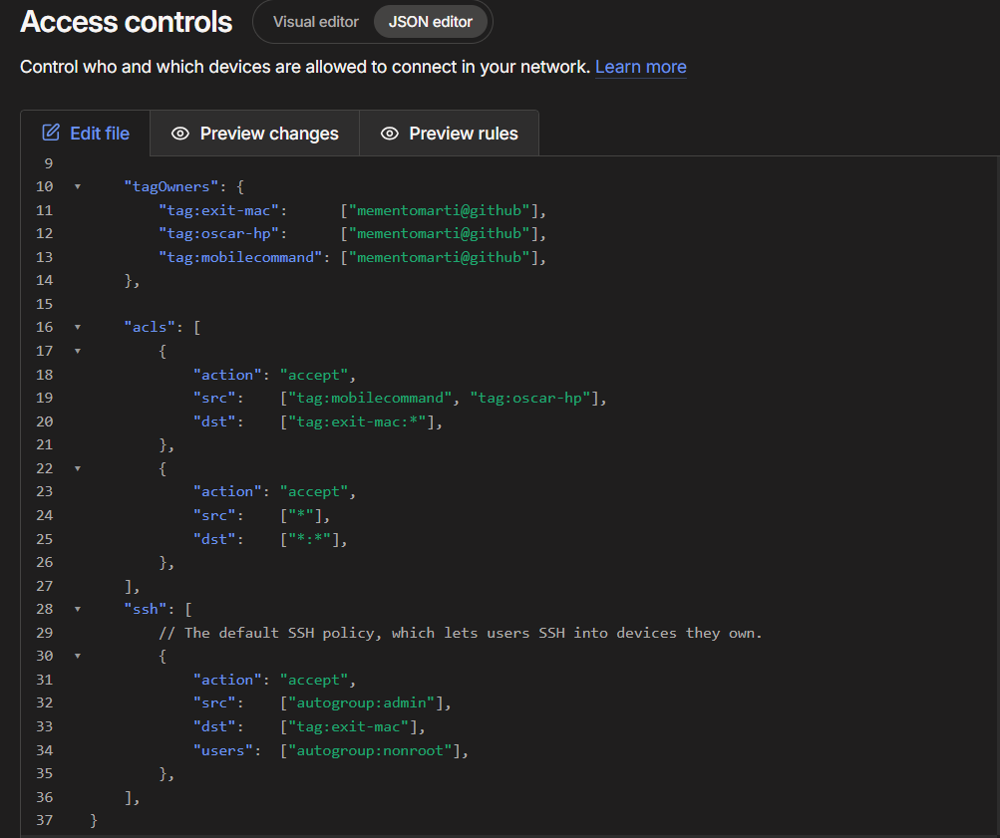

# Home Lab - Tailscale Mesh VPN

## Overview
This project documents the steup of a self-hosted mesh VPN using Tailscale to securely connect personal devices across iOS, macOS, and Windows. The goal was twofold: enable encrypted device-to-device communication for file sharing during a transition betwen laptops, and protect outbound traffic on public Wi-Fi networks by tunnleing through a designated exit node at home. During testing, I identified a limitation in this architecture, outbound traffic still exits through my home address which informed the next phase of the project: a migration to self-hosted WireGuard for full control over the VPN stack.

## Architecture
The network consists of three personal devices connected via Tailscale's mesh VPN. Each device serves a distinct role: a primary archive, an active workstation, and a personal mobile device.

## Devices

| Device      | OS      | Role                                         |
|-------------|---------|----------------------------------------------|
| Macbook Air | macOS   | File archive (personal documents), exit node |
| HP Laptop   | Windows | Active workstation (school, project work)    |
| iPhone      | iOS     | Personal mobile device                       |

### Topology
[iPhone] <-----[HP Laptop]
    \   SMB File   /
     \  Transfer  /
      \          /
[Tailscale Mesh Network]
            |
      [MacBook Air]
   (Archive + Exit Node)
            |
      [Home Network]
            |
        [Internet]

### File Sharing
File transfer between the HP laptop and iPhone is handled via SMB shares over the Tailscale network. Tailscale's built-in file sharing feature was tested but did not meet the use case. The current SMB implementation supports push transfer but lacks bidirectional pull access, which is one of the limitations driving the migration to a more flexible self-hosted solution.

## Setup

### 1. Identity and Authentication
Tailscale was configured to use GitHub as the identity provider, with GitHub's 2FA acting as a second factor for account access, device authorization, and policy changes.

### 2. Initital Installation
Tailscale was installed first on the Macbook Air (designated as the primary archive and exit node), then on the iPhone via the iOS app, and finally on the HP laptop running the Windows client. Each device authenticated through the GitHub-linked Tailscale account.

### 3. Device Tagging
Each device was assigned a tag in the policy file for use in ACL rules:
| Device      | Tag               |
|-------------|-------------------|
| Macbook Air | tag:exit-mac      |
| HP Laptop   | tag:oscar-hp      |
| iPhone      | tag:mobilecommand |

### 4. Exit Node Configuration
The Macbook Air was designated as the exit node. During initital setup, the exit node toggle was disabled and would not stay active. The issue was traced to ACL policy. Without explicit rules permitting traffic from client devices to the exit node, Tailscale would not enable the route. Adding an ACL rule allowing 'tag:oscar-hp' and 'tag:mobilecommand' to reach 'tag:exit-mac' resolved the issue.

### ACL Policy
The current policy contains two rules: a specific rule allowing client devices to route traffic through the exit node, and a permissive rule allowing all-to-all communication across the mesh. The second rule was added during troubleshooting to eliminate ACL conflicts and remains in place for general device communication. Tightening this to least-privilege rules is identified as a future improvement.

### 6. SSH Access
The default Tailscale SSH policy is in effect, allowing admin users to SSH into the exit node as non-root users.

### 7. File Sharing Layer
SMB shares were configured on the Windows host to enable file transfer with the iPhone over the Tailscale network.

## Limitations
This setup is functional but has known limitations identified during testing and use. Documenting them is part of the project. Each limitation informs the design of the next phase.

### 1. Home IP Exposure at Exit Node
When client devices route outbound traffic through the MacBook Air exit node, the traffic exits to the public internet through the home ISP's IP address. While this protects traffic from observation on public Wi-Fi, it does not anonymize the user. Any service receiving the traffic sees the home IP. True IP masking would require either a remote exit node (e.g., a VPS) or chaining the exit node through an additional layer such as Tor or a commercial VPN.

### 2. No Bidrectional File Access
File sharing between the iPhone and HP laptop relies on SMB shares hosted on the Windows machine. This supports push transfers (sending files to the share_ but does not provide a pull workflow. The iPhone cannot natively browse and retrieve arbitrary files from the other devices. Tailscale's built-in file sharing was tested and did not meet the use case. A more flexible solution would require a self-hosted file service (e.g., SFTP, Nextcloud, or a properly mounted SMB client on iOS).

### 3. Permissive ACL Policy
The current ACL policy includes a fallback rule allowing all devices to communicate with all other devices ('src: ["*"], dst: ["*:*"]'). This was introduced during troubleshooting to isolate the exit node issue and was retained for general connectivity. It does not enforce least-privilege access between devices. A future iteration of the policy willr estrict communication to the minimum required for each device's role.

## What I Learned
-**Mesh VPN architecture** : how peer-to-peer encrypted connections differ from traditional hub-and-spoke VPN topology, and the tradeoffs of each.
-**WireGuard Protocol** : Tailscale is built on WireGuard; understanding this clarified the underlying tunneling mechanism and informed the decision to migrate to a self-hosted WireGuard implementation.
-**Exit node routing** : how outbound traffic can be routed through a designated peer, and the IP visibility implications of doing so
-**ACL policy design** : using tags and rule precedence to control device-to-device communication, and the difference between permissive defaults and least privilege configurations.
-**Identity and authentication** : using GitHub as an identity provider with 2FA for VPN access control.
-**Trust boundaries on public Wi-Fi** : what a VPN tunnel does and does not protect against, including the distinction between traffic encryption and IP anonymization.
-**Limitations of consumer mesh VPN tools** : identifying where managed solutions like Tailscale stop meeting requirements, and what capabilities require self-hosted alternatives

## Next Steps
This Tailscale implementation serves as the foundation for a broader home lab project. Identified next steps include:
-**Migrate to self-hosted Wireguard** : replace Tailscale with a self-managed WireGuard server to gain full control over the VPN stack and deepend understanding of the udnerlying protocol.
-**Address home IP exposure** : implement a routing layer that prevents outbound traffic from exiting through the home ISP's IP address
-**Improve file access** : replace SMB with a more flexible self-hosted file service supporting biderectional access.
-**TIghten ACL policy** : replace the permissive fallback rule with least-privilege rules scoped to each device's role
-**Build a Linux-based home lab** : introduce a Linux VM environment to host the WireGuard server and serve as a platform for further security practice (red and blue team)
